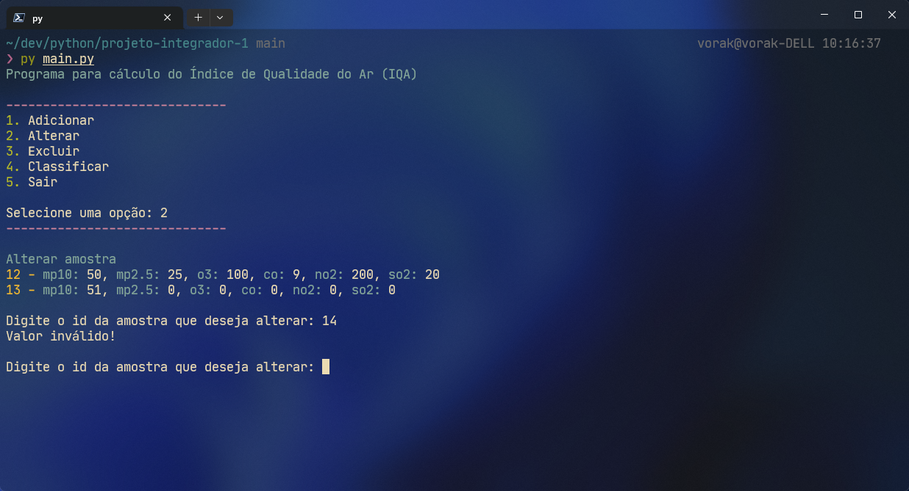

# Calculador de Índice de Qualidade do Ar (IQA)

-   Conta do GitHub: Rodolfo Infantini Carneiro

## Grupo:

-   Cecília Rufatto dos Reis - 23012297
-   Gabriel Ferraro Ferragute - 23013742
-   Lara Bassinello Grandi - 23005879
-   Rafael Oliveira Silva - 23002269
-   Rodolfo Abrahão de Araújo- 23000994
-   Rodolfo Infantini Carneiro - 23000993

*   adicionar letras:
    
*   adicionar:
    
*   alterar amostra:
    
*   alterar id invalido:
    
*   alterar letras:
    
*   alterar menu:
    
*   alterar sem amostras:
    
*   amostras cadastradas para classificacao:
    
*   classificar sem amostras:
    
*   classificar:
    
*   excluir cancelar:
    
*   excluir confirmar:
    
*   excluir id invalido:
    
*   excluir menu:
    
*   excluir resposta invalida:
    
*   excluir sem amostras:
    
*   menu opcao invalida:
    
*   menu:
    
*   sair:
    

